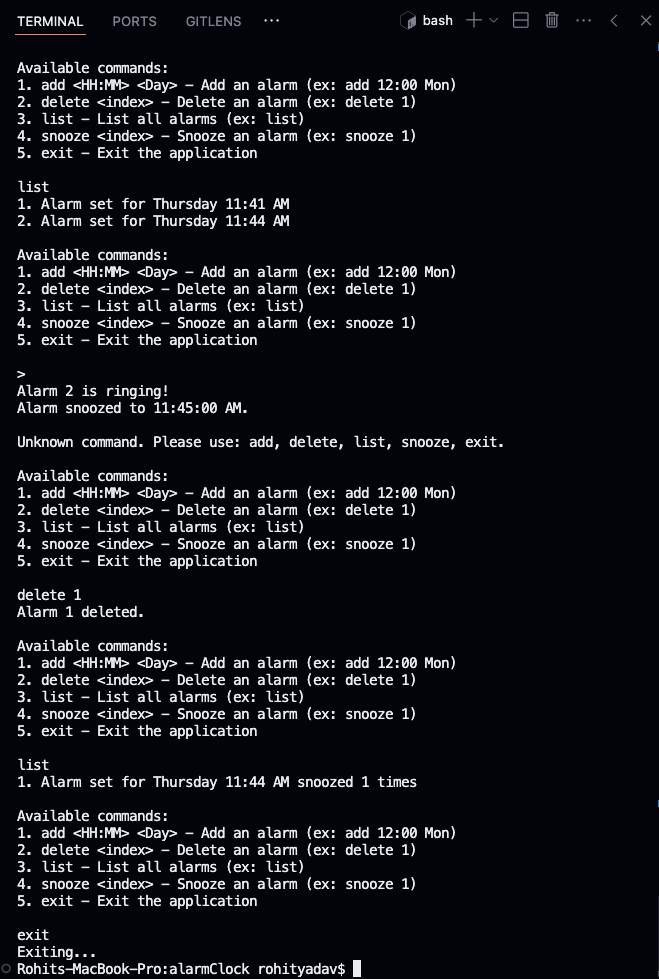

# Alarm Clock CLI Application

A command-line interface (CLI) application that allows users to set, manage, and snooze alarms based on specific times and days of the week. This project demonstrates the use of object-oriented programming (OOP) principles and asynchronous programming in JavaScript.

## Table of Contents

- [Features](#features)
- [Getting Started](#getting-started)
  - [Prerequisites](#prerequisites)
  - [Installation](#installation)
- [Usage](#usage)
  - [Commands](#commands)
- [Screenshot](#screenshot)
- [Architecture](#architecture)
  - [Alarm](#alarm)
  - [AlarmManager](#alarmmanager)
  - [Clock](#clock)

## Features

- Add alarms for specific times and days of the week
- List all active alarms
- Snooze alarms for a customizable number of times
- Delete alarms
- Continuously checks for upcoming alarms and alerts the user when an alarm goes off

## Getting Started

These instructions will guide you on how to set up and run the project on your local machine.

### Prerequisites

- Node.js 
- npm (comes with Node.js)

### Installation

1. Clone the repository:

    ```bash
    git clone https://github.com/rohity123456/alarmclock.git
    cd alarmclock
    ```

2. Start the application:

    ```bash
    npm start
    ```

## Usage

Once the application is running, you can interact with it using the following commands:

## Screenshot



### Commands

- **Add Alarm**: Add an alarm with a specific time and day.

    ```bash
    add <HH:MM> <Day>
    ```

- **List Alarms**: View all currently set alarms.

    ```bash
    list
    ```

- **Snooze Alarm**: Snooze a specific alarm.

    ```bash
    snooze <index>
    ```

- **Delete Alarm**: Remove an alarm.

    ```bash
    delete <index>
    ```

- **Exit**: Exit the application.

    ```bash
    exit
    ```

## Architecture

The application follows a modular and OOP-based architecture:

### Alarm

- Represents an individual alarm.
- Stores the time, day and snooze count.
- Provides methods to snooze the alarm.

### AlarmManager

- Manages multiple alarms.
- Provides methods to add, delete, list, and check alarms.

### Clock

- Keeps track of the current time.
- Updates the current time periodically.

